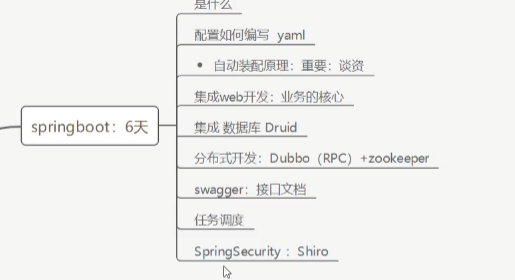

# Spring Boot 是什么

## 是一个框架

相比其他的框架（如Srping），SpringBoot一个最大特点就是**自动装配**





# 自动配置原理初探


自动配置  

 **pom.xml**

- spring-boot-dependencies：核心依赖在父工程中
- 我们自己在引入一些SpringBoot的依赖的时候，不需要指定版本，因为版本已经在上述的文件中指定。


**启动器**

```xml
<dependency>
    <groupId>org.springframework.boot</groupId>
    <artifactId>spring-boot-starter-XXX</artifactId>
</dependency>

```

- 比如spring-boot-starter-Web，会帮助我们自动导入web环境所有的依赖！相当于一个功能环境包
- 我们需要什么功能，就只需要找到对应的启动器就可以了。 


