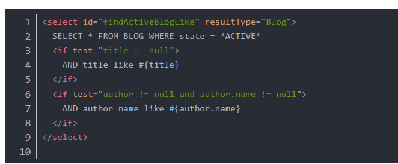
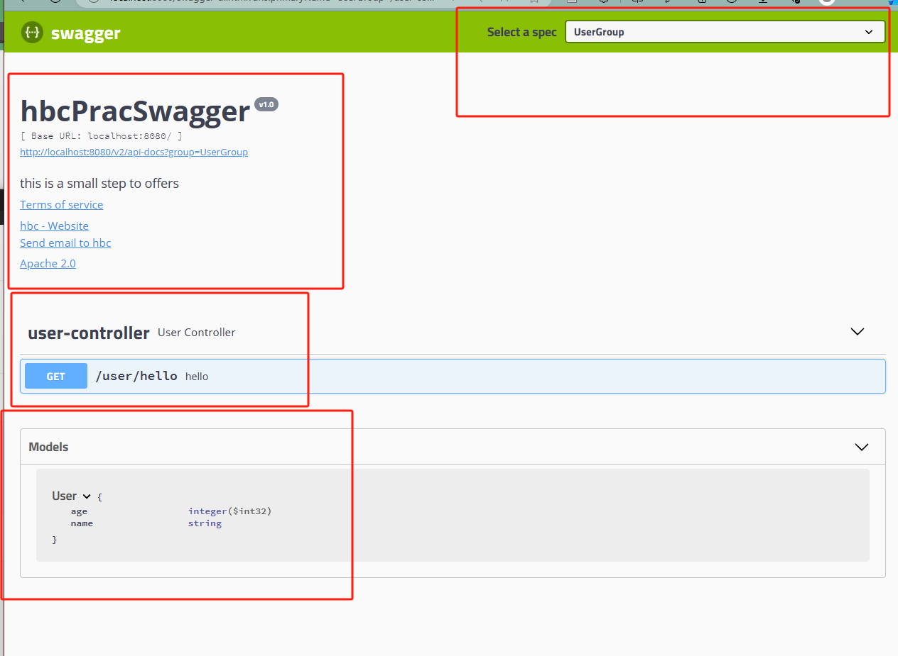
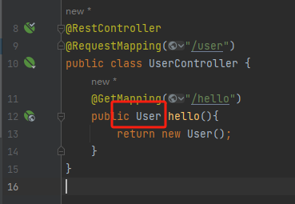
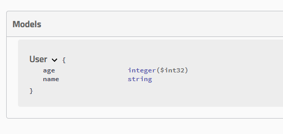
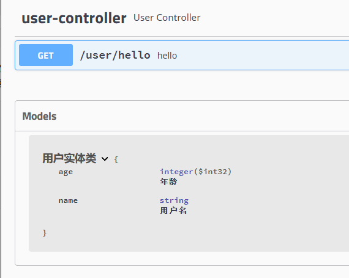
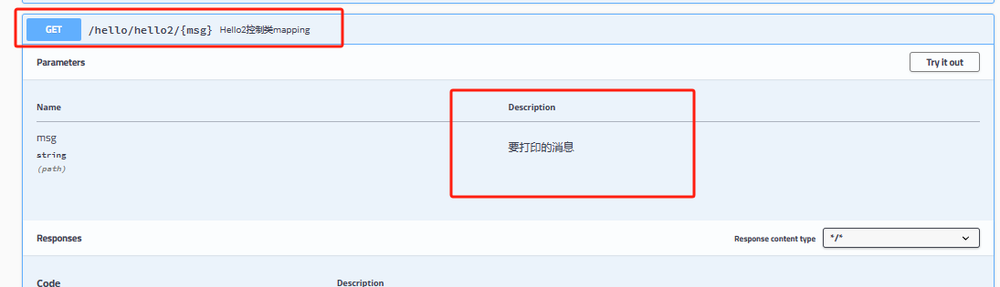
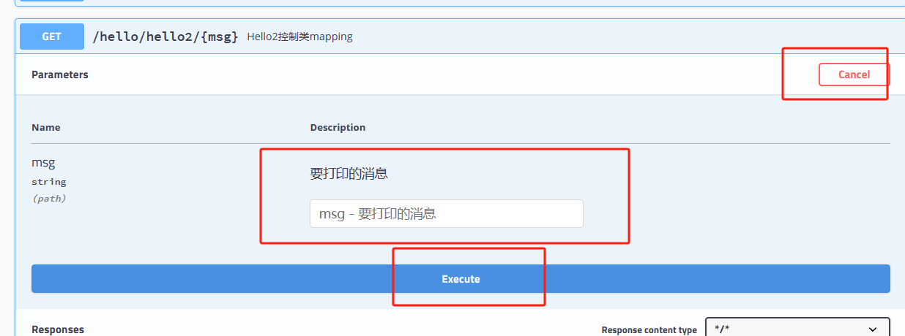
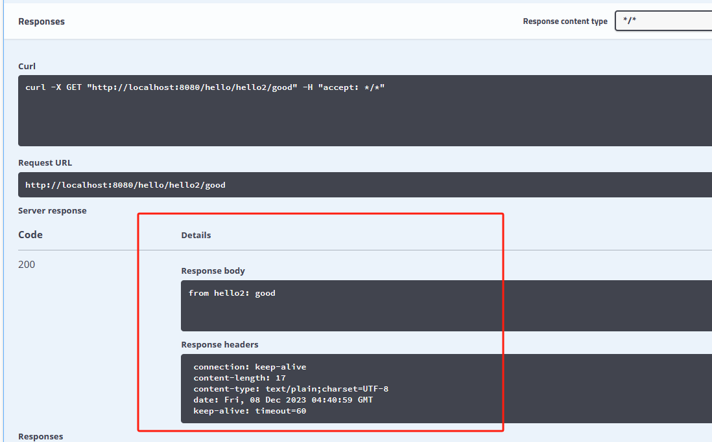

# MVC常用注解

- @Repository 用于注解Dao类
- @Service 用于注解service层的类
- @Controller 同理

# Web需要解决的问题

- 导入静态资源
- 首页
- jsp，模板引擎Thymeleaf
- 装配拓展SpringMVC
- 增删改查
- 拦截器
- 国际化


## 关于静态资源

我们可以放以下目录,这样不需要controller的mapping，也能直接通过url访问


- clashpath:/resource

- clashpath:/static(默认用这里)

- clashpath:/public

  


## 模板引擎

之前spring开发中，我们需要配置viewResolver来解析渲染视图，制定好prefix和suffix后，我们在controller只需要return ”xx“就行，不需要return ”xx.html“（xx.html这个文件得放在prefix定义的目录内）。

springboot也是一样，其中一个称之为模板引擎的组件就是搞这个的，一个常见的实现是thymeleaf。但是springboot默认没加载，得手动加

```xml
<dependency>
    <groupId>org.thymeleaf</groupId>
    <artifactId>thymeleaf-spring5</artifactId>
</dependency>
<dependency>
    <groupId>org.thymeleaf.extras</groupId>
    <artifactId>thymeleaf-extras-java8time</artifactId>
</dependency>
```

按照springboot的命名规则，我们如果要配置属性，在application.yaml内配置就行，然后底层会存在叫做**thyemeleafProperties**的class，其使用@ConfigurationProperties注解来绑定。


果然是这样吧。


同时autoconfig这个springboot部件内也有thymeleafAutoConfiguration这样的自动配置类，因此完成了thymeleaf相关依赖的自动装载。


但现在实际开发是前后端分离的更多些，后端只需要写好接口返回json文件，渲染view那些交给前端，也不太需要模板引擎对这种不分离的的model and view渲染。


## 拓展springMVC的feature

比如我们不想用thymeleaf这个viewResolver（模板引擎、视图解析器），我们要用自己创建的，那怎么才能用上呢？

答案：在**WebMvcConfigurer实现类**的上面标注**@Configuration**，在内部声明好ViewResolver类型的bean即可。

另外的例子就是@override来重写方法

```java
@Configuration
public class MyConfig implements WebMvcConfigurer {
    //把ViewResolver添加到到容器里
    @Bean
    public ViewResolver myViewResolver(){
        return  new MyViewResolver();
    }
    
    @Override
    public void addViewControllers(ViewControllerRegistry registry) {
        registry.addViewController("/hbc").setViewName("index");
    }

}

//下面是自己定义的ViewResolver
class MyViewResolver implements ViewResolver{
    @Override
    public View resolveViewName(String viewName, Locale locale) throws Exception {
        return null;
    }
}
```

这样WebMvcConfigurer会扫描项目所有的ViewResolver，也包含我们创建的。

注意，**不能注明**@EnableWebMvc注解，它会导致默认的WebMvc的默认autoConfig失效（因为webMvcAutoConfiguration上有个condition，存在某个bean，那就不生效，而@EnableWebMvc刚好实现了这个bean接口，所以寄了）

 

如果使用thymeleaf接管viewResolver，在访问静态资源时，可以这样

```html
   <link th:href="@{/css/signin.css}" rel="stylesheet" type="text/css">
```

其中css文件放在**static**文件夹内


## 国际化

#### i18n配置文件

在application.properties中写好要支持多语言的配置，比如我要对login页面搞多语言支持，那就填入以下信息

```
spring.messages.basename=i18n.login
```

在resource目录下创建`i18n`文件夹，在里面写入多个语言配置文件。

```properties
login.properties  //默认
login_zh_CN.properties  //中
login_en_US.properties	//英
```

以`login_zh_CN.properties `为例，内容包含key-value对

```properties
login.username=请输入用户名
```

#### 前端

在前端html要展示这段文字的地方这样写

```html
 <input  th:placeholder="#{login.username}" required="" autofocus="">
```

使用`th:placeholder="#{login.username}"`这样的格式去声明此处要填入多语言，以login.username位key来根据环境填入value

前端页面这样写，点击的话会调用/signin这个mapping，并传入参数`language='zh_CN'`

```html
<a class="btn btn-sm" th:href="@{/signin(language='zh_CN')}">中文</a>
<a class="btn btn-sm" th:href="@{/signin(language='en_US')}">English</a>
```

#### 后端

后端也得要处理这个语言并设置激活哪个。创建LocaleResolver的实现类

```java
public class MyLocaleResolver implements LocaleResolver {
    @Override
    public Locale resolveLocale(HttpServletRequest request) {
//        System.out.println("hhhhhhhhh");
        String language = request.getParameter("language");
        if(!StringUtils.isEmpty(language)){
            String[] split = language.split("_");
//            System.out.println("language: "+ language);
            return  new Locale(split[0], split[1]);
        }
        Locale locale = Locale.getDefault();
        return  locale;
    }

    @Override
    public void setLocale(HttpServletRequest request, HttpServletResponse response, Locale locale) {

    }
}
```

并注入到IOC容器内，之后就可以了

```java
    @Bean
    public LocaleResolver localeResolver(){
        return  new MyLocaleResolver();
    }
```

关键点：**bean名称必须是localeResolver**，因为spring底层会根据bean的名称来添加localeResolver，改了识别不到，只会当作普通的bean。


## 登陆+拦截器

登陆如果通过了账户校验，就添加session，记录用户信息。

```java
@RequestMapping("/signin")
public String signin(@RequestParam("username") String username,
				@RequestParam("password") String password,
				Model model, HttpSession session){
    if(!StringUtils.isEmpty(username) && "123456".equals(password)){
        session.setAttribute("loginUser",username);
        return "redirect:/main.html";
    }
    model.addAttribute("msg", "用户名或者密码错误!");
    return  "sign-in";
}
```


同时添加拦截器：该拦截器适用于全局的，所有请求（除了指定排除的请求）都会进行拦截，然后判断有无session，如果没有的话就返回登录页这样子。

```java
//自定义拦截器
public class LoginHandlerInteceptor implements HandlerInterceptor{
    @Override
    public boolean preHandle(HttpServletRequest request, HttpServletResponse response, Object handler) throws Exception {
        //登入成功后，应该有用户session
        Object loginUser = request.getSession().getAttribute("loginUser");
        if(loginUser == null){
            request.setAttribute("msg", "没有权限，请先登陆");
            request.getRequestDispatcher("index.html").forward(request, response);
            return false;
        }
        return true;
    }
}
```

```java
//添加拦截器到容器内 
@Configuration
public class MyMvcConfig implements WebMvcConfigurer {
    ...
	@Override
	public void addInterceptors(InterceptorRegistry registry) {
        registry.addInterceptor(new LoginHandlerInteceptor())
              .addPathPatterns("/**").excludePathPatterns("/index.html", 					"/","/user/signin", "/css/*", "/js/**", "/img/**");
    }
    ...
}
```

可以看到以上@Configuration注解和WebMvcConmfigurer接口配合，在内部重写方法，就完成了springMVC的feature拓展。

## Jdbc连接数据库

在application.yaml的配置文件中，声明好connector、dataSource类型以及属性就行。然后在Dao类中加入jdbcTemplate的自动注入@Autowired


------


# Druid

不用springBoot内置的几个默认dataSource，我们换用第三方的，如Druid，可以这样去配置。

使用方式：

1. 首先添加Druid依赖，可以从mavenRepository官网查询

2. 在application.yaml中写入以下配置, 以此设定使用第三方的dataSource实现

   ```yaml
   spring:
   	datasource:
   		#以下是要添加的
   		type: com.alibaba.druid.pool.DruidDataSource
   ```
   
   
   
3. 创建druid相关的属性配置文件，放在application.yaml中。

4. ```yaml
   myDruidConfig:
   	# 连接属性
       username: xxx
       password: xxx
       url: jdbc:mysql//xxxx
       driver-class-name: com.mysql.xxxx.Driver
       
   	# 常规属性
   	minIdel: 5
   	maxActive: 20
   	
   	#让Druid优于其他dataSource的关键，可以配置功能强大的拦截器，有这样几种: stat用于监控统计  Log4j用于日志, wall用于防止sql注入攻击。 需要这些功能就填入进去
   	filters: stat, wall, log4j
   	#这些拦截器的依赖需要我们自己写入到maven依赖中，不然会报错
   ```
   
   
   
5. 将属性配置绑定到DruidDataSource实例中。具体而言需要创建一个配置类。

   ```java
   @Configuration
   public class DruidConfig{
       
       //prefix必须全小写
       @ConfigurationProperties(prefix="mydruidconfig")
       @Bean
       public DataSource druidDataSource){
           return new DruidDataSource();
       }
       
       //我估计druid内部会自动注入以下bean作为自己的属性。
       @Bean
        public ServletRegistrationBean statViewServlet(){
            ServletRegistrationBean<StatViewServlet> bean = new 
                ServletRegistrationBean<>(new StatViewServlet(), "/druid/*");
            
            HashMap<String, String> initParams = new HashMap<>();
            
            //这两个key是druid固定的，定义在druid库的常量中的
            initParams.put("loginUsername", "admin");
            initParams.put("loginPassword", "123456");
            
            //允许谁能访问
            initParams.put("allow", "");
            
         
            bean.setInitParameters(initParams);
            return bean;         
        } 
   }
   ```


------


# Mybatis

文档参考：[mybatis – MyBatis 3 | Getting started](https://mybatis.org/mybatis-3/getting-started.html)

## 1，基础使用

1. 创建Mapper层（Dao层）

   ```java
   @Mapper     //用于mybatis标识
   @Repository //用于注入IOC
   public interface UserMapper{
       User getUserById(Integer id);
       int addUser(User user);
   }
   ```

2. 创建mapper的配置文件。放在 resources/mybatis/mapper目录下面. 以UserMapper.xml为例

   ```xml
   <?xml version="1.0" encoding="UTF-8"?>
   <!DOCTYPE   mapper PUBLIC "-//mybatis.org//DTD Mapper 3.0//EN"
           "http://mybatis.org/dtd/mybatis-3-mapper.dtd"
           >
   <mapper namespace="com.hbc.spring05mmybatis.mapper.UserMapeer">
       <select id="getUserById" resultType="User">
           select * from testUser where id = #{id};
       </select>
   
       <insert id="addUser" parameterType="User">
           insert into testUser(id, name, age) values (#{id}, #{name}, #{age});
       </insert>
       
           <update>
       	......
       </update>
       
       <delete>
       	......
       </delete>
   </mapper>
   
   ```

   

3. 在application.yaml文件配置相关信息

   ```yaml
   mybatis:
   	type-aliases-package: com.hbc.pojo  # 这里是实体类的位置
   	mappert-locations: classpath:mybatis/mapper/*.xml # 这里是mapper配置的xml文件
   	
   ```

   

4. Controller的编写（省得打代码，先不写service层了。controller直接调用mapper）

```java
   @RestController
   public class UserController{
   	@Autowired
       private UserMapper userMapper; // Mapper实现类（Dao实现类）
   
   	@GetMapping("/getUserById")
   	public User getUserById(Integer id){
           User user = userMapper.getUserById(id);
           return user;
       }
       
       @GetMapping("/addUser")
   	public User addUser(User user){
           userMapper.addUser(user);
           return "ok";
       } 
   }
```

5. 收工！ 可以发现，在~~传递参数~~以及对象封装方面，mybatis相比jdbcTemplate更加方便。原先需要自己定义RowMapper，现在不用了。**但是！原先Dao使用jdbcTemplate写法时可以简单地进行额外逻辑判断，但现在如果要加逻辑判断的话，要写在mapper.xml文件中**，不是java语法，需额外专门学习。



entity: pojo

dao->XXXmapper接口{@Mapper @Repository}

resource-> xxxMapper.xml{写sql语句，与mapper定义的接口对接}

application.yaml-> 配置dataSource，配置mybatis{实体类目录pojo， XXXMapper.xml所在目录}


----


# springSecurity

是针对Spring项目的安全框架，只用进行少量的配置，就能完成强大的安全管理。

几个关键类与注解

- WebSecurityConfigurerAdapter： 自定义Security策略
- AuthenticationManagerBuilder： 自定义认证策略
- @EnableWebSecurity: 开启WebSecurity模式

比如vipX才能进levelX下的页面。先通过授权，来完成页面和权限的绑定；

在通过认证，完成用户与权限的绑定。

```java
@EnableWebSecurity
public class
SecurityConfig extends  WebSecurityConfigurerAdapter{

    //授权
    @Override
    protected void configure(HttpSecurity http) throws Exception {
//        super.configure(http);
        //首页所有人可以访问，但功能也只有对应有权限的人才能访问
        http.authorizeHttpRequests()
                .antMatchers("/").permitAll()
                .antMatchers("/level1/**").hasRole("vip1")
                .antMatchers("/level2/**").hasRole("vip2")
                .antMatchers("/level3/**").hasRole("vip3");

        //没权限的默认跳转至登陆页面
        http.formLogin().loginPage("/toLogin");
        http.logout().logoutSuccessUrl("/");

    }


    //认证
    @Override
    protected void configure(AuthenticationManagerBuilder auth) throws Exception {
//        super.configure(auth);

        //以下数据正常应该是从数据库读，但现在从内存里读。
        auth.inMemoryAuthentication().passwordEncoder(new BCryptPasswordEncoder())
                .withUser("hbc")
                .password(new BCryptPasswordEncoder().encode( "123456"))
                .roles("vip2", "vip3")
                .and()
                .withUser("root")
                .password(new BCryptPasswordEncoder().encode( "123456"))
                .roles("vip1","vip2", "vip3")
                .and()
                .withUser("guest")
                .password(new BCryptPasswordEncoder().encode( "123456"))
                .roles("vip1");

    }
}
```

Spring Security的两个主要目标：”认证“和”授权“

c认证：是面向用户的， eg，用户与vip等级，给用户一个vip等级

z授权：是面向内容的，eg，vip页面与vip等级，对应等级的才能进


# shiro

## 1, 基础使用

​	

### 导入依赖

```xml
<dependency>
    <groupId>org.apache.shiro</groupId>
    <artifactId>shiro-spring</artifactId>
    <version>1.13.0</version>
</dependency>
```


### 创建shiro的配置类,以此往IOC中注入shiro的bean。

在内部导入realm -> SecurityManager -> ShiroFilterFactoryBean。

| 名称                   | 作用                                                         |
| ---------------------- | ------------------------------------------------------------ |
| realm                  | 负责和底层数据库打交道，配置认证和授权。                     |
| Manager                | 管理所有用户                                                 |
| Subject                | 用户（通过 `SecurityUtils.getSubject()`方法获取）            |
| ShiroFilterFactoryBean | 设置拦截器，比如页面的授权拦截器，以及一些认证、授权后的页面跳转设置 |


```java

@Configuration
public class ShiroConfig {

    // ShiroFilterFactoryBean
    @Bean
    public ShiroFilterFactoryBean shiroFilterFactoryBean(){
        ShiroFilterFactoryBean bean = new ShiroFilterFactoryBean();
        bean.setSecurityManager(defaultWebSecurityManager());
        System.out.println("====>from shiroBean: mannager id: "+bean.getSecurityManager());

        /*
        * anno
        * authc
        * user
        * perms
        * role
        * */
        Map<String, String> filterMap = new HashMap<>();

        //添加shiro的内置过滤器,完成页面拦截
//        filterMap.put("/user/add", "authc");
//        filterMap.put("/user/update", "authc");
//        bean.setFilterChainDefinitionMap(filterMap);

        //授权
        filterMap.put("/user/add", "perms[user:add]");
        filterMap.put("/user/*", "authc");
        bean.setFilterChainDefinitionMap(filterMap);


        //设置未认证时的跳转登陆页面url
        bean.setLoginUrl("/toLogin");

        //设置未授权时的跳转页面
        bean.setUnauthorizedUrl("/noauth");

        return  bean;
    }


    //DefaultWebSecurityManager 管用户的
    @Bean
    public DefaultWebSecurityManager defaultWebSecurityManager(){
        DefaultWebSecurityManager manager = new DefaultWebSecurityManager();
        manager.setRealm(userREALM());
        System.out.println("realms sizE:"+ manager.getRealms().size());
        System.out.println("=======>from manager: "+((ArrayList) manager.getRealms()).get(0));
        System.out.println("manager id: "+ manager);
        return manager;
    }


    //realm, 管数据的
    @Bean
    public UserREALM userREALM(){
        UserREALM userREALM =  new UserREALM();
        System.out.println("========>from userREALM: "+ userREALM);
        return  userREALM;
    }

}
```

### 创建自定义的realm实现

```java
public class UserREALM extends AuthorizingRealm {
    @Autowired
    UserService userService;

    UserREALM(){
        System.out.println("userRealm is created");
    }

    //授权
    @Override
    protected AuthorizationInfo doGetAuthorizationInfo(PrincipalCollection principalCollection) {
        System.out.println("执行了=>授权");
        SimpleAuthorizationInfo info = new SimpleAuthorizationInfo();
        info.addStringPermission("user:add");
        return info;
    }


    //认证
    @Override
    protected AuthenticationInfo doGetAuthenticationInfo(AuthenticationToken authenticationToken) throws AuthenticationException {
        System.out.println("执行了=>认证");
        UsernamePasswordToken token = (UsernamePasswordToken) authenticationToken;
        User user = userService.getUserByName(token.getUsername());

         if(user == null) //没在数据库找到该用户
            return  null;


        //密码认证，由shiro来去做. 此处传递的是数据库中user的密码
        return new SimpleAuthenticationInfo("", user.getPwd() ,"");
    }
}
```

比如我现在是一个用户想要访问某个页面，shiro会进入自定义的realm实现，对当前用户进行认证和授权的判断以及增强。

**eg，认证：**在`doGetAuthenticationInfo`函数中，可以从数据库中寻找有无我这个用户或者密码是否正确，并进行相应的响应（此处配合下面controller的/login代码中的`subject.login(token)`）。

**eg, 授权**：在`doGetAuthorizationInfo`函数中，可以完成当前权限的判断，来决定是否增加新权限。

这两个函数如果认证或者授权不通过，会返回null。


### 设置controller

接受用户的登陆信息，然后通过**`subject.login(token);`**进行登陆操作。如果登陆失败，会弹出Exception，eg账号名称不正确`UnknownAccountException`， 密码错误`IncorrectCredentialsException`。

```java
    @RequestMapping("/login")
    public String login(String username, String password, Model model){
        //获取当前用户
        Subject subject = SecurityUtils.getSubject();
        //令牌
        UsernamePasswordToken token = new UsernamePasswordToken(username, password);

        try {
            //登陆
            subject.login(token);
            return "redirect:/";
        }catch (UnknownAccountException e){
            model.addAttribute("msg", "unknownAccount error !");
            return "login";
        }catch (IncorrectCredentialsException e){
            model.addAttribute("msg", "incorrectPassWord error !");
            return "login";
        }
    }


    @RequestMapping("/logout")
    public String logout(){
        Subject subject = SecurityUtils.getSubject();
        subject.logout();
        return "redirect:/";
    }

    @RequestMapping("/noauth")
    @ResponseBody
    public String noAuth(){
        return "未经授权，无法访问";
    }


```


## 理解

1. 点击一个网页，shiro会把我这个用户请求创建封装成一个subject对象，然后通过**Shiro拦截**（获取注入到IOC的ShiroFilterFactoryBean获取）。在这个拦截器里，定义了**拦截哪些网页**，以及需要什么权限。

2. 对于被拦截的网页， 如果当前subject还没login，甚至直接完成拦截了，不继续后续（或者仅跳过步骤3、4），直接跳转到设定好的跳转页面（理由：点击被拦截的网页， realm的doAuthC和doAuthZ没有sout消息）。

3. 跳到登陆页面后，提交form到指定的controller的url中，shiro通过`SecurityUtils.getSubject();`获取当前subject对象，并把登陆信息封装为`UsernamePasswordToken`类型的token，使用` subject.login(token);`尝试进行登陆。

4. 如果当前subject已经login了，然后会拦截是否生效前，会把用户的**认证和授权信息**通过**realm进行判断**，来判断是否通过认证或者授权，这个过程我们可以连接到数据库来进行实际逻辑的判断来进行认证授权的赋予，并返回用户**最终的认证和授权信息**。

5. 之后重新到**Shiro拦截器**里，对**用户对象状态**与**拦截器`Map<url, 认证or授权条件>`**来进行匹配，看我们最终的认证和授权信息来**决定最终是否通过拦截器**

6. Shiro拦截器（ShiroFilterFactoryBean）也定义了一些**跳转url**，来指导认证、授权通过（不通过）时如何响应请求。

   

---


# Swagger

能够扫描到controller定义的各种接口并用ui界面展示出来，方便前后端开发协同。参考文档：[Setting Up Swagger 2 with a Spring REST API | Baeldung](https://www.baeldung.com/swagger-2-documentation-for-spring-rest-api#swagger)




## 1, 基础配置

### 添加依赖

```xml
<dependency>
    <groupId>com.spring4all</groupId>
    <artifactId>swagger-spring-boot-starter</artifactId>
    <version>1.9.1.RELEASE</version>
</dependency>
```

### 添加配置类

```java
@EnableSwagger2
@Configuration
// @Profile({"dev","test"})
public class SwaggerConfig  {
    @Bean
    public Docket api(Environment environment){
        Profiles profiles = Profiles.of("dev", "test");
        boolean flag = environment.acceptsProfiles(profiles);

        return new Docket(DocumentationType.SWAGGER_2)
                .apiInfo(apiInfo())
                .groupName("HelloGroup")
                .enable(flag) //来决定是否启用，但我觉得还是在类上加上@Profile注解更方便
                .select()
                //RequestHandlerSelectors用于配置要扫描的接口的方式
                    //basePackage为扫描指定的包下的接口
                    //none、any如名所说
                    //withClassAnnotation： 根据类上的注解来筛选扫描， eg： RestController.class
                    //withMethodAnnotation： 根据方法上的注解来筛选扫描， eg： GetMapping.class
                .apis(RequestHandlerSelectors.basePackage("com.example.spring08swagger.controller"))
                //.paths() 用于过滤路径, 比如有UserController， HelloController，
                //输入参数"/hello/**"， 则只有url前缀有"/hello"的请求才会被扫描到swagger
                .paths(PathSelectors.ant("/hello/**"))
                .build();
    }
	
    //定义多个Docket，形成不同的组
    @Bean
    public Docket api2(Environment environment){
        Profiles profiles = Profiles.of("dev", "test");
        boolean flag = environment.acceptsProfiles(profiles);
        return new Docket(DocumentationType.SWAGGER_2)
                .apiInfo(apiInfo())
                .groupName("UserGroup")
                .enable(flag)
                .select()
                //RequestHandlerSelectors用于配置要扫描的接口的方式
                //basePackage为扫描指定的包下的接口
                //none、any如名所说
                //withClassAnnotation： 根据类上的注解来筛选扫描， eg： RestController.class
                //withMethodAnnotation： 根据方法上的注解来筛选扫描， eg： GetMapping.class
                .apis(RequestHandlerSelectors.basePackage("com.example.spring08swagger.controller"))
                //.paths() 用于过滤路径, 比如有UserController， HelloController，
                //输入参数"/user/**"， 则只有url前缀有"/user"的请求才会被扫描到swagger
                .paths(PathSelectors.ant("/user/**"))
                .build();
    }


    private ApiInfo apiInfo(){
        Contact contact = new Contact("hbc",
                "https://ieeexplore.ieee.org/author/37089935525",
                "1242582816@qq.com");

        return new ApiInfo("hbcPracSwagger",
                "this is a small step to offers",
                "v1.0",
                "http://192.168.2.144",
                contact,
                "Apache 2.0",
                "http://www.apache.org/licenses/LICENSE-2.0",
                new ArrayList()
                );
    }

}


```

可以发现我们能定义多个Docket，并命名不同的groupName。开发中可以对应不同的开发者， 他们负责不同的controller，这样可以在ui页面快速选择group，来查看对应的接口swagger信息。

### 关于实体类的swagger扫描

需要controller的返回值为“xx实体类”，这样才会被swagger扫描到该类






### 提示消息

##### 1，实体类提示消息

我们可以给实体类添加提示信息，让swagger在ui界面展示，方便前后端协同开发。具体方法为在实体类，以及实体类属性上使用**@ApiModel**与**@ApiModelProperty**注解。

```java
@ApiModel("用户实体类")
public class User {
    @ApiModelProperty("用户名")
    public String name;
    @ApiModelProperty("年龄")
    public Integer age;
}
```



可以发现现在model框有提示消息了

##### 2，controller提示消息

两个注解：

- **@ApiOperation**用于注解方法，告诉别人这个方法是干啥的；

- **@ApiParam**用于注解输入参数，告诉别人这个输入参数是啥；

```java
@ApiOperation("Hello2控制类mapping")
@GetMapping("/hello2/{msg}")
public String hello2(@PathVariable("msg") @ApiParam("要打印的消息") String msg){
        return  "from hello2: " + msg;
}
```




## 2，基础使用

进入对应的接口，点击tryout，然后输入参数，点Execute

如果需要传入参数，看起来是需要getMapping配合restful；或者PostMapping才行。

getMapping和普通传参那种不支持。



以下是执行结果：



可以看到能够返回json数据


---


# 异步

开启：

- 在application上加上**@EnableAsync**;

-  在方法上面加上**@Aysnc** 注解

```java
@Service
public class AsyncService {

    @Async
    public void hello(){
        try {
            Thread.sleep(3000);
        } catch (InterruptedException e) {
            throw new RuntimeException(e);
        }
        System.out.println("正在处理数据中...已完成");
    }
}


@SpringBootApplication
@EnableAsync
public class Spring07asyncApplication {

    public static void main(String[] args) {
        SpringApplication.run(Spring07asyncApplication.class, args);
    }

}
```


---


# 定时

开启：

- 在application上加上**@EnableScheduling**

- 在方法上面加上**@Scheduled** 注解

```java
//秒 分 时 日 月  周几~
//  0 * * * * ? 每分钟的0秒
//  30 10/5 10，18 * * ？ 每天10点和18点从第10分钟开始，每隔5分钟的30s执行一次
//  0 15 10 ? * 1-6 每个月周一到周六的10点15分执行一次

@Scheduled(cron = "0 * * * * ?")
public void MySchedule(){
System.out.println("定时任务， 启动！"+ new Date());
}
```

  


