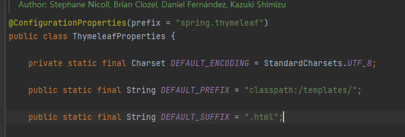
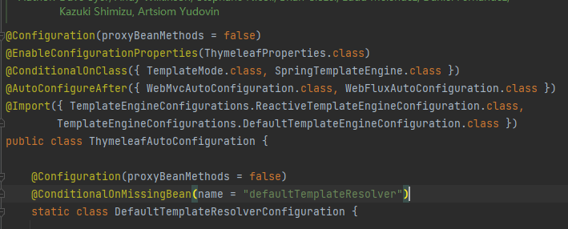

# Web需要解决的问题

- 导入静态资源
- 首页
- jsp，模板引擎Thymeleaf
- 装配拓展SpringMVC
- 增删改查
- 拦截器
- 国际化


## 关于静态资源

我们可以放以下目录,这样不需要controller的mapping，也能直接通过url访问


- clashpath:/resource

- clashpath:/static(默认用这里)

- clashpath:/public

  


## 模板引擎

之前spring开发中，我们需要配置viewResolver来解析渲染视图，制定好prefix和suffix后，我们在controller只需要return ”xx“就行，不需要return ”xx.html“（xx.html这个文件得放在prefix定义的目录内）。

springboot也是一样，其中一个称之为模板引擎的组件就是搞这个的，一个常见的实现是thymeleaf。但是springboot默认没加载，得手动加

```xml
<dependency>
    <groupId>org.thymeleaf</groupId>
    <artifactId>thymeleaf-spring5</artifactId>
</dependency>
<dependency>
    <groupId>org.thymeleaf.extras</groupId>
    <artifactId>thymeleaf-extras-java8time</artifactId>
</dependency>
```

按照springboot的命名规则，我们如果要配置属性，在application.yaml内配置就行，然后底层会存在叫做**thyemeleafProperties**的class，其使用@ConfigurationProperties注解来绑定。



果然是这样吧。



同时autoconfig这个springboot部件内也有thymeleafAutoConfiguration这样的自动配置类，因此完成了thymeleaf相关依赖的自动装载。


但现在实际开发是前后端分离的更多些，后端只需要写好接口返回json文件，渲染view那些交给前端，也不太需要模板引擎对这种不分离的的model and view渲染。


## 拓展springMVC的feature

比如我们不想用thymeleaf这个viewResolver，我们要用自己创建的，那怎么才能用上呢？

答案：在**WebMvcConfigurer实现类**的上面标注**@Configuration**，在内部声明好ViewResolver类型的bean即可。

另外的例子就是@override来重写方法

```java
@Configuration
public class MyConfig implements WebMvcConfigurer {
    @Bean
    public ViewResolver myViewResolver(){
        return  new MyViewResolver();
    }
    
    @Override
    public void addViewControllers(ViewControllerRegistry registry) {
        registry.addViewController("/hbc").setViewName("index");
    }

}

//下面是自己定义的ViewResolver
class MyViewResolver implements ViewResolver{
    @Override
    public View resolveViewName(String viewName, Locale locale) throws Exception {
        return null;
    }
}
```

这样WebMvcConfigurer会扫描项目所有的ViewResolver，也包含我们创建的。

注意，**不能注明**@EnableWebMvc注解，它会导致默认的WebMvc的默认autoConfig失效（因为webMvcAutoConfiguration上有个condition，存在某个bean，那就不生效，而@EnableWebMvc刚好实现了这个bean接口，所以寄了）

 

如果使用thymeleaf接管viewResolver，在访问静态资源时，可以这样

```html
   <link th:href="@{/css/signin.css}" rel="stylesheet" type="text/css">
```

其中css文件放在**static**文件夹内


## 国际化

#### i18n配置文件

在application.properties中写好要支持多语言的配置，比如我要对login页面搞多语言支持，那就填入以下信息

```
spring.messages.basename=i18n.login
```

在resource目录下创建`i18n`文件夹，在里面写入多个语言配置文件。

```properties
login.properties  //默认
login_zh_CN.properties  //中
login_en_US.properties	//英
```

以`login_zh_CN.properties `为例，内容包含key-value对

```properties
login.username=请输入用户名
```

#### 前端

在前端html要展示这段文字的地方这样写

```html
 <input  th:placeholder="#{login.username}" required="" autofocus="">
```

使用`th:placeholder="#{login.username}"`这样的格式去声明此处要填入多语言，以login.username位key来根据环境填入value

前端页面这样写，点击的话会调用/signin这个mapping，并传入参数`language='zh_CN'`

```html
<a class="btn btn-sm" th:href="@{/signin(language='zh_CN')}">中文</a>
<a class="btn btn-sm" th:href="@{/signin(language='en_US')}">English</a>
```

#### 后端

后端也得要处理这个语言并设置激活哪个。创建LocaleResolver的实现类

```java
public class MyLocaleResolver implements LocaleResolver {
    @Override
    public Locale resolveLocale(HttpServletRequest request) {
//        System.out.println("hhhhhhhhh");
        String language = request.getParameter("language");
        if(!StringUtils.isEmpty(language)){
            String[] split = language.split("_");
//            System.out.println("language: "+ language);
            return  new Locale(split[0], split[1]);
        }
        Locale locale = Locale.getDefault();
        return  locale;
    }

    @Override
    public void setLocale(HttpServletRequest request, HttpServletResponse response, Locale locale) {

    }
}
```

并注入到IOC容器内，之后就可以了

```java
    @Bean
    public LocaleResolver localeResolver(){
        return  new MyLocaleResolver();
    }
```

关键点：**bean名称必须是localeResolver**


## 登陆+拦截器

登陆如果通过了账户校验，就添加session，记录用户信息。

```java
@RequestMapping("/signin")
public String signin(@RequestParam("username") String username,
				@RequestParam("password") String password,
				Model model, HttpSession session){
    if(!StringUtils.isEmpty(username) && "123456".equals(password)){
        session.setAttribute("loginUser",username);
        return "redirect:/main.html";
    }
    model.addAttribute("msg", "用户名或者密码错误!");
    return  "sign-in";
}
```


同时添加拦截器：该拦截器适用于全局的，所有请求（除了指定排除的请求）都会进行拦截，然后判断有无session，如果没有的话就返回登录页这样子。

```java
//自定义拦截器
public class LoginHandlerInteceptor implements HandlerInterceptor{
    @Override
    public boolean preHandle(HttpServletRequest request, HttpServletResponse response, Object handler) throws Exception {
        //登入成功后，应该有用户session
        Object loginUser = request.getSession().getAttribute("loginUser");
        if(loginUser == null){
            request.setAttribute("msg", "没有权限，请先登陆");
            request.getRequestDispatcher("index.html").forward(request, response);
            return false;
        }
        return true;
    }
}
```

```java
//添加拦截器到容器内 
@Configuration
public class MyMvcConfig implements WebMvcConfigurer {
    ...
	@Override
	public void addInterceptors(InterceptorRegistry registry) {
        registry.addInterceptor(new LoginHandlerInteceptor())
              .addPathPatterns("/**").excludePathPatterns("/index.html", 					"/","/user/signin", "/css/*", "/js/**", "/img/**");
    }
    ...
}
```


## 阿萨

